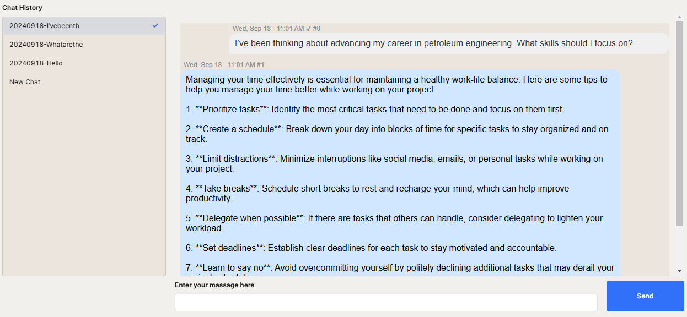

# Employee Assistance Chatbot

## Overview
This chatbot was developed during my internship at **Aramco's Advanced Research Center (ARC)**. It is specifically designed to assist ARC employees by answering questions related to **petroleum research** and **general life topics**. 

The chatbot serves as a user-friendly solution to streamline information retrieval and improve workplace productivity.

---

## Features
- **AI-Powered Responses**: Built using **GPT-3.5**, the chatbot provides intelligent and context-aware responses to both petroleum-related and general queries.
- **Chat History Storage**: Conversations are stored in a **Retool database**, enabling employees to revisit previous chats for reference.
- **Customizable UI**: The user interface was built using **Retool's Custom Components**, ensuring a smooth and efficient user experience.

---

## Technologies Used
- **OpenAI GPT-3.5**: for AI-based conversational capabilities.
- **Retool**: for user interface design and database integration.
- **Retool Database**: for storing and managing chat history.

---

## Usage
To run this project:
1. Download the `App_retool.json` file included in this repository.
2. Log in to your **Retool** account.
3. Go to the **Apps** section in Retool and click **Import**.
4. Upload the `App_retool.json` file to import the chatbot project.
5. Configure the required database and API keys (e.g., OpenAI GPT-3.5 API key) to make the chatbot functional.

> **Note:** You will need a valid **Retool workspace** and API key to run this project successfully.

---

## How to Use
1. Open the imported chatbot app in your Retool workspace.
2. Type your question or query in the chat window.
3. Refer to past conversations using the chat history feature.

---

## App UI
Below is an example of the chatbot interface:  

---

## Acknowledgments
Special thanks to the **Advanced Research Center (ARC)** team at Aramco for their guidance and support throughout this project.

---

## License
This project is proprietary and was developed during my internship at Aramco. Redistribution or modification of this project is not permitted without explicit authorization.
